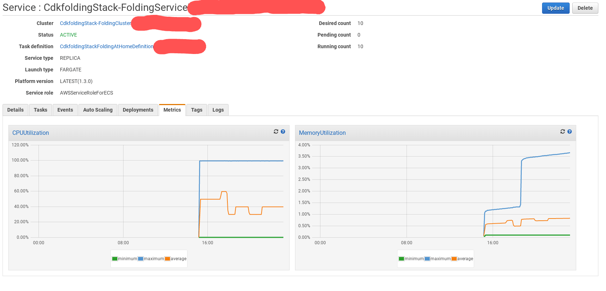

## Docker folding@home conatiner

Debian stretch imagine with folding at home set to run as part of the containers team.
You can override this by adding the flags:

```
--user=YOUR_NAME --team=TEAM_NUMBER --gpu=false --smp=true
```

Currently COVID19 is taking prioroty so its a great cause that we all need right now.

## Running manually

To run simply type:

```
docker run -d -p7396:7396 richarvey/foldingathome:latest
```

You can get to the webUI on [http://localhost:7396](http://localhost:7396)

## Deploying on ECS/Fargate Using CDK

We've included CDK fiels to help you deploy on AWS in fargate, check out [https://docs.aws.amazon.com/cdk/latest/guide/getting_started.html](https://docs.aws.amazon.com/cdk/latest/guide/getting_started.html) to get setup.

The `cdk.json` file tells the CDK Toolkit how to execute your app.

Once installed run:

```
cd cdk
npm install
npm run build
cdk deploy
```

### Useful commands

 * `npm install -g aws-cdk`	install the aws cdk
 * `npm install`     install all required modules
 * `npm run build`   compile typescript to js
 * `cdk diff`        compare deployed stack with current state
 * `cdk synth`       emits the synthesized CloudFormation template
 * `cdk deploy`      deploy this stack to your default AWS account/region



### Manually switching to SPOT (save some money)

Get your account id:

```
aws sts get-caller-identity
```

Using the aws CLI and changing the ARN / region:

```
aws ecs put-cluster-capacity-providers --cluster arn:aws:ecs:eu-west-1:YOUR_ACCOUNT_ID:cluster/CdkfoldingStack-FoldingClusterYOUR_CLUSTER_UID --capacity-providers FARGATE FARGATE_SPOT --default-capacity-provider-strategy capacityProvider=FARGATE_SPOT,weight=100 --region eu-west-1
```
